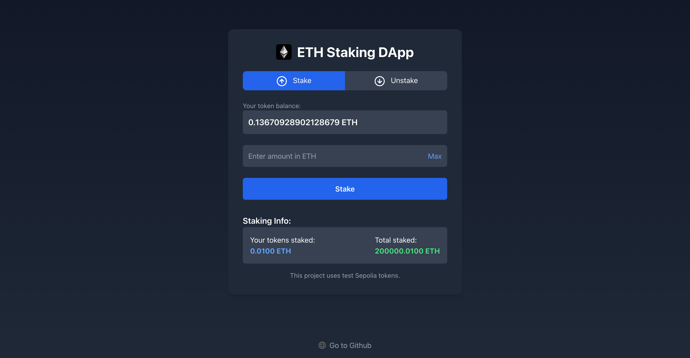

# ETH Staking DApp

This is a decentralized application (DApp) for staking Ethereum (ETH) tokens built using **Next.js** for the frontend and **Hardhat** for the backend. The application interacts with a smart contract deployed on the Sepolia test network to allow users to stake and unstake ETH and view their staking details.

[Staking DApp](https://staking-dapp-sigma-six.vercel.app)


---

## Features

- **Connect Wallet:** Connect to the DApp using MetaMask or other supported wallets.
- **Stake ETH:** Stake any amount of Ethereum to earn rewards.
- **Unstake ETH:** Unstake your ETH and withdraw it along with any rewards.
- **View Balances:** View your wallet balance, staked ETH, and the total amount staked in the contract.
- **Test Tokens:** This DApp uses test Sepolia tokens for all transactions.

---

## Tech Stack

### Frontend

- **Framework:** [Next.js](https://nextjs.org/)
- **Styling:** [DaisyUI](https://daisyui.com/) and Tailwind CSS
- **Wallet Integration:** [Ethers.js](https://docs.ethers.io/)

### Backend

- **Smart Contract Development:** [Hardhat](https://hardhat.org/)
- **Language:** Solidity
- **Network:** Sepolia (Ethereum Testnet)

---

## Setup Instructions

### Prerequisites

- [Node.js](https://nodejs.org/) installed on your machine
- [MetaMask](https://metamask.io/) extension installed
- Sepolia test ETH (can be obtained from a [faucet](https://sepoliafaucet.com/))

### Clone the Repository

```bash
git clone https://github.com/FedorLivshits/staking-dapp.git
cd staking-dapp
```
